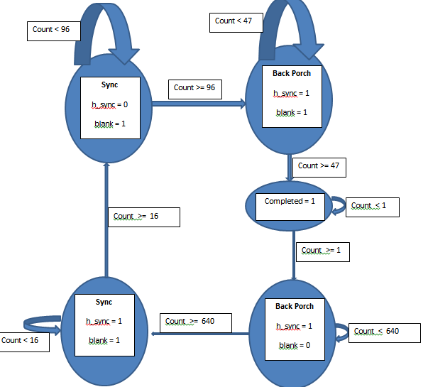

ECE383_Lab1
===========

Introduction
============

The purpose of this lab is to write code that enables the FPGA to control a monitor’s output via a 
VGA-to-HDMI cable.

Implementation
==============
There are two modules that generate the signals necessary to run the monitor’s display. 
These modules are h_sync and v_sync. They each include five very similar state machines 
that drive whether or not a color is displayed, or nothing is displayed at all based on timing. 
Below is a state diagram showing these states, their outputs, and how they are interconnected 
to form a Moore machine.



To allow these machines to function appropriately, it was necessary to use “look ahead buffer” logic, 
which prevented glitches by helping to smooth out the process of moving to the next state register, 
or the next counter/column number. Note how in the code below, 
the new data values are set to a buffer before being transitioned to the actual signal.

Code that permits buffering

```vhdl
when sync =>
  h_sync_next <= '0';
  blank_next <= '1';
  column_next <= (others => '0');
  completed_next <= '0';
```

```vhdl
--output buffer
process(clk)
begin
  if (rising_edge(clk)) then
    h_sync_reg <= h_sync_next;
    blank_reg <= blank_next;
    column_reg <= column_next;
    completed_reg <= completed_next;
  end if;
end process;
```

```vhdl
--output
h_sync <= h_sync_reg;
blank <= blank_reg;
column <= column_reg;
completed <= completed_reg;
```

The first block of code is the state machine applying its logic, while the second block of code 
is the buffer for that logic. Finally, the last block shows the code being sent to the actual outputs.

This same logic is applied to v_sync, however v_sync used h_completed (a signal from h_sync)
as a criterion for when it increments it’s counter. This allows the row to only increment once a column 
has been completed. 

Next, h_sync is joined with v_sync in the vga_sync module. This module connects 
h_sync and v_sync together, and provides the outputs that they are both able to generate together to the topshell, atlys_lab_video.


Test/Debug
==========

* The first module that I tested was h_sync. To accomplish this, I made a test bench for 
h_sync and used assert statements to check if the states were transitioning as they should. 
Unfortunately I encountered an off by one error. To fix this, I changed the sensitivity list of the output logic. Before, it used counter_reg as its trigger, and after changing counter_reg to counter_next 
the problem was resolved. I also changed this for the input of column_next.
  * This allowed the column_next signal to get the information is required before the state had changed.

* The second module I test was v_sync. I started working on a test bench for v_sync, and quickly realized that it required h_sync to function properly. After realizing this, I instantiated an h_sync component in the test bench, and connected I to v_sync to enable me to conduct my testing. After running some assertion tests, I quickly realized that I once again had an off by one error.
  * This time, the fix was much different. Captain Branchflower showed me that if I encased my next-state logic in an if-statement that checked for h_completed being high, the problem would be resolved. 
  * The problem was that the state was transitioning before the count was complete. By adding the if statement checking if h_completed was active, this prevented the state from changing until the appropriate time.

* Next I wrote a quick test bench for vga_sync to ensure that the signals were working together appropriately. I visually checked this without using any assertions, and it was evident that the output was appropriate.


Conclusion
==========

This lab taught me the importance of thinking about vhdl code as a set of hardware components. 
It’s a very different mindset than what is used in normal procedural programming such as C or Java. 
Through completing A functionality, I also gained a greater understanding of the configuration file 
and how it fits into the bigger picture. For future classes, I would recommend informing them that 
they need to use the configuration file to enable their switches to work appropriately. I would
not have been able to figure this out without teacher assistance, and know some of my classmates
had no idea that this was necessary until I informed them of how I completed the functionality.
